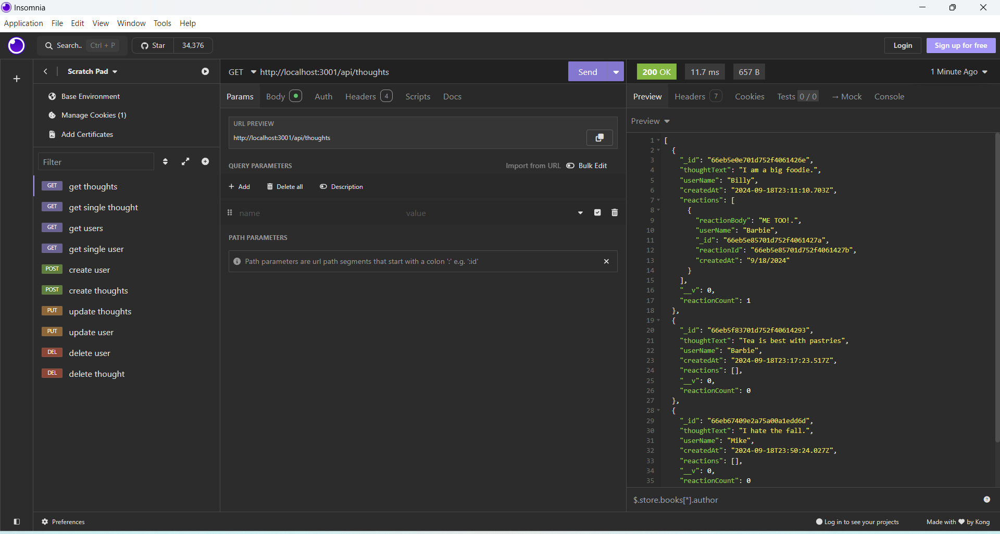

# Social API 

## Description
- The social API project was created to understand how to use no SQL databases. In this project, mongoDB is ulitized to create this API and through building this project I learned how to set up mongoDB schemas, models, routes, and controllers to have the API run smoothly.

## Installation
- This project can be installed by simply downloadin the code from this git repo and running it in your terminal.

## Usage
- To actually use this api, it must be run in the terminal by using the command npm start to start the server from there you can use the api to retrieve the relevant data. Here is the demo link for using the social api with the insomnia tool. https://drive.google.com/file/d/1lHMVAmtwbB8eKCG2IMtjitZ9qV9HdgjE/view This is a screenshot of how it looks like when the Thoughts information is being retrieved from the database through insomnia.

## Credits
- Virtuals - https://mongoosejs.com/docs/tutorials/virtuals.html
- Example code from University of Minnesota Bootcamp

## License
- MIT License
